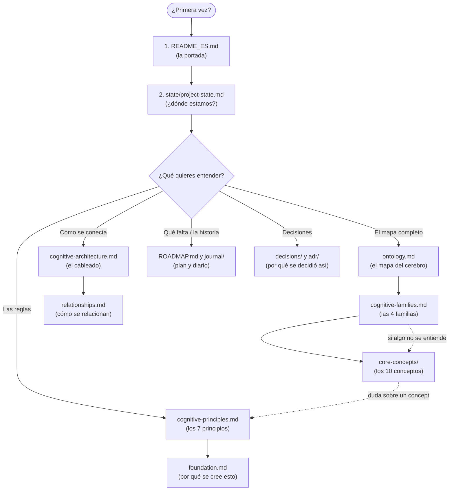

# Manual de Usuario — Company OS

Versión: 1.0
Estado: Oficial
Owner: Company OS
Fecha: 2026-07-31
Idioma: Español

---

## 1. ¿Qué es esto?

**Company OS** es un proyecto que define **cómo debería pensar una organización** (o un sistema inteligente que trabaja para ella).

No es un programa que se instala ni un software que se ejecuta. Es un **manual de arquitectura mental**: un conjunto de conceptos, reglas y estructuras que explican, de forma ordenada y precisa, cómo se pasa de *ver algo* a *hacer algo* con sentido.

> **Analogía:** imagina que una empresa es un ser vivo. Company OS es el manual que explica cómo funciona su cerebro: cómo ve, cómo razona, cómo decide y cómo aprende.

La idea central del proyecto es esta frase, que vas a encontrar repetida en todos los documentos:

> **"Los conceptos son estables. La inteligencia vive en las transformaciones entre ellos."**

En palabras simples: lo importante no es *qué sabe* un sistema, sino *cómo pasa* de una idea a la siguiente.

---

## 2. La idea en una analogía sencilla

Imagina que eres un **médico**.

1. **Observas** al paciente: tiene fiebre, dolor de cabeza. *(Observación)*
2. **Agrupas** los síntomas. *(Evidencia)*
3. **Interpretas**: puede ser una gripe, puede ser otra cosa. *(Contexto)*
4. Notas que **cada invierno pasa lo mismo**. *(Patrón)*
5. Un día, algo **no encaja**: el paciente no tiene síntomas respiratorios. *(Anomalía)*
6. **Supones** una explicación que se puede comprobar. *(Hipótesis)*
7. De golpe **conectas** dos datos que no habías relacionado. *(Insight)*
8. Evalúas **qué tan seguro** estás. *(Confianza)*
9. **Sugieres** un tratamiento. *(Recomendación)*
10. Decides **aplicarlo** y te comprometes. *(Decisión)*
11. Semanas después **recuerdas el caso** y aprendes de cómo terminó. *(Memoria — futura)*

Ese camino completo es el **Flujo Cognitivo** de Company OS.

---

## 3. El Flujo Cognitivo (el camino del conocimiento)

Toda la inteligencia de Company OS se organiza en este camino. Cada "escalón" convierte lo que recibió en algo más útil.

### Gráfico del flujo cognitivo

```mermaid
flowchart LR
    R[REALIDAD<br/>lo que existe] --> O[OBSERVACIÓN<br/>capturar sin interpretar]
    O --> E[EVIDENCIA<br/>organizar hechos]
    E --> C[CONTEXTO<br/>interpretar]
    C --> P[PATRÓN<br/>ver lo repetido]
    P --> A[ANOMALÍA<br/>detectar lo raro]
    A --> H[HIPÓTESIS<br/>suponer y predecir]
    H --> I[INSIGHT<br/>reestructurar el entendimiento]
    I --> CF[CONFIANZA<br/>medir la seguridad]
    CF --> R1[RECOMENDACIÓN<br/>proponer acción]
    R1 --> D[DECISIÓN<br/>comprometerse]
    D --> M[MEMORIA<br/>aprender del resultado (futura)]
    M -.vuelve a empezar.-> O
```

### Versión en texto plano

```
REALIDAD
   ↓
OBSERVACIÓN        captura un hecho sin interpretarlo
   ↓
EVIDENCIA          organiza los hechos
   ↓
CONTEXTO           interpreta con el mejor modelo mental
   ↓
PATRÓN             reconoce lo que se repite
   ↓
ANOMALÍA           detecta lo que no encaja
   ↓
HIPÓTESIS          propone una explicación comprobable
   ↓
INSIGHT            reorganiza el entendimiento
   ↓
CONFIANZA          mide qué tan seguro está
   ↓
RECOMENDACIÓN      propone una acción
   ↓
DECISIÓN           se compromete con la acción
   ↓
MEMORIA (futura)   consolida el resultado y aprende
```

### Qué significa cada paso (con analogía)

| Paso | Definición simple | Analogía |
|---|---|---|
| **Observación** | Un hecho capturado sin opinión. | "El termómetro marca 38°". |
| **Evidencia** | Varios hechos que juntos hacen sentido. | "Fiebre + dolor de cabeza + cansancio". |
| **Contexto** | La interpretación más coherente. | "Probablemente una gripe". |
| **Patrón** | Lo que se repite con regularidad. | "Cada invierno tengo gripe". |
| **Anomalía** | Lo que se sale del patrón. | "Hace 3 años no me enfermaba en verano". |
| **Hipótesis** | Una explicación que se puede probar. | "Puede ser que mi sistema inmune bajó". |
| **Insight** | Conectar ideas que estaban separadas. | "Ah, esto empezó cuando cambié de turno". |
| **Confianza** | Qué tan seguro estoy, medido. | "Estoy 85% seguro, no 100%". |
| **Recomendación** | Proponer qué hacer. | "Sugiero hacerse análisis". |
| **Decisión** | Comprometerse a hacerlo. | "Voy al laboratorio mañana". |
| **Memoria (futura)** | Guardar y aprender del resultado. | "La próxima vez iré antes". |

---

## 4. Estructura de carpetas (la biblioteca del proyecto)

Company OS es un repositorio organizado como una **biblioteca técnica**. Cada carpeta tiene un rol preciso.

```
company-os-main/
├── README_ES.md / README_EN.md      → LA PORTADA (resumen oficial en español / inglés)
├── adr/                               → LAS ACTAS (decisiones de arquitectura)
│   └── ADR-0001-company-os-is-the-brain.md
├── decisions/                         → EL DIARIO DE DECISIONES
├── docs/                              → LA BIBLIOTECA PRINCIPAL
│   ├── brand/                         → CÓMO COMUNICA LA MARCA
│   ├── business/                      → EL NEGOCIO
│   ├── cognitive-architecture/        → CÓMO SE CONECTAN LAS PIEZAS
│   ├── cognitive-lexicon/             → EL DICCIONARIO DEL CEREBRO (EL CORAZÓN)
│   │   ├── core-concepts/             → LOS 10 CONCEPTOS, uno por archivo
│   │   ├── cognitive-principles.md    → LOS 7 PRINCIPIOS
│   │   ├── cognitive-families.md      → LAS 4 FAMILIAS
│   │   ├── ontology.md                → EL MAPA COMPLETO
│   │   ├── relationships.md           → CÓMO SE RELACIONAN LOS CONCEPTOS
│   │   ├── concept-template.md        → LA PLANTILLA PARA NUEVOS CONCEPTOS
│   │   └── ROADMAP.md                 → QUÉ FALTA
│   ├── engineering/                   → LA DISCIPLINA DE INGENIERÍA
│   ├── foundation/                    → LOS FUNDAMENTOS FILOSÓFICOS
│   ├── product/                       → EL PRODUCTO
│   └── research/                      → LA INVESTIGACIÓN Y SU HISTORIA
├── journal/                           → EL DIARIO DE PROGRESO (por punto de cambio)
├── rfc/                               → EL BUZÓN DE PROPUESTAS
├── state/                             → EL PUNTO DE CONTROL (estado actual)
└── templates/                         → PLANTILLAS DE DOCUMENTOS
```

### Analogías de cada carpeta

| Carpeta | Analogía |
|---|---|
| `README_ES.md` | La **portada del libro**: qué es esto de un vistazo. |
| `docs/cognitive-lexicon/` | El **diccionario del cerebro**: define cada concepto con precisión. |
| `docs/cognitive-architecture/` | El **diagrama de cableado**: cómo se conectan las piezas. |
| `docs/foundation/` | La **filosofía**: en qué ideas se apoya todo. |
| `journal/` | El **diario de progreso**: qué se descubrió en cada cambio del estado canónico. |
| `state/project-state.md` | El **indicador de progreso**: en qué punto estamos hoy. |
| `adr/` y `decisions/` | Las **actas de reunión**: decisiones importantes quedan escritas. |
| `rfc/` | El **buzón de sugerencias**: cómo se proponen cambios. |
| `templates/` | Las **plantillas**: cómo escribir cualquier documento nuevo. |

---

## 5. El flujo de LECTURA e INTERPRETACIÓN del manual

Así como el sistema tiene un flujo de conocimiento, **tú también tienes un camino de lectura recomendado**. Este gráfico te dice por dónde empezar y cómo ir interpretando cada documento.



### Versión en texto plano

```
¿Primera vez en el proyecto?
        │
        ▼
   1. README_ES.md .............. la portada: qué es Company OS
        │
        ▼
   2. state/project-state.md .... el punto de control: en qué fase estamos
        │
        ▼
   ¿Qué quieres entender?
        │
        ├──► El mapa completo ───► ontology.md
        │                              │
        │                              ▼
        │                    cognitive-families.md
        │                              │
        │                              ▼
        │                    core-concepts/  (10 conceptos)
        │
        ├──► Las reglas ────────► cognitive-principles.md
        │                              │
        │                              ▼
        │                    foundation.md
        │
        ├──► Cómo se conecta ──► cognitive-architecture.md
        │                              │
        │                              ▼
        │                    relationships.md
        │
        ├──► Qué falta y la historia ► ROADMAP.md  +  journal/
        │
        └──► Decisiones ───────► decisions/  +  adr/
```

### Consejo de lectura para cada tipo de lector

| Tipo de lector | Camino recomendado |
|---|---|
| **Curioso** (quiere entender la idea) | README → journal → ontology (solo la sección del flujo) |
| **Técnico** (quiere construir) | README → cognitive-architecture → engineering → core-concepts |
| **Investigador** (quiere conocer la base) | foundation → research → cognitive-principles |
| **Decisor** (quiere usar la idea en su empresa) | README → product → business → ontology |
| **Mantenedor** (quiere seguir el proyecto) | state/project-state → ROADMAP → journal → templates |

---

## 6. Los 10 conceptos, explicados como a un niño

Cada concepto es un archivo en `docs/cognitive-lexicon/core-concepts/`. Su estructura es **siempre la misma** (por eso es fácil de leer): definición, propósito, por qué importa, contrato cognitivo, relaciones, ejemplos, no-ejemplos, implicaciones de diseño y notas de evolución.

### 6.1 Observación — *capturar*
Un hecho, tal como ocurrió, sin opiniones.
> Ejemplo: "El servidor tardó 8 segundos en responder." ✔ (es una observación)
> "El servidor está lento." ✘ (eso ya es una interpretación)

### 6.2 Evidencia — *organizar*
Juntar observaciones que se sostienen entre sí.
> Ejemplo: "8 segundos de respuesta + CPU al 95% + memoria al 90%".

### 6.3 Contexto — *interpretar*
Elegir la interpretación más coherente con la evidencia.
> Ejemplo: "El servidor muestra signos de agotamiento de recursos." (igual podría ser un ataque; se elige lo más coherente).

### 6.4 Patrón — *generalizar*
Lo que se repite.
> Ejemplo: "El backup falla todos los viernes a las 23:00."

### 6.5 Anomalía — *detectar desvío*
Lo que rompe el patrón.
> Ejemplo: "El martes también falló." (no hay error en la observación; hay una señal).

### 6.6 Hipótesis — *predecir*
Una explicación comprobable.
> Ejemplo: "El job de mantenimiento del viernes cambió de horario."

### 6.7 Insight — *reestructurar*
Conectar lo que estaba separado.
> Ejemplo: "El backup, la lentitud y los errores de disco son el mismo problema: el controlador de almacenamiento está saturado."

### 6.8 Confianza — *calibrar*
Qué tan seguro estoy, medido y con historial.
> Ejemplo: "Tengo 90% de confianza porque 9 de cada 10 predicciones similares fueron correctas."

> **Marco formal:** el cálculo exacto (soporte de evidencia, coherencia explicativa, calibración histórica y error de calibración) está especificado en el **Modelo de Calibración** de `docs/cognitive-lexicon/core-concepts/confidence.md`. La confianza no es una intuición: es un cálculo reproducible y falsable.

### 6.9 Recomendación — *proponer*
Una acción sugerida con su porqué y sus alternativas.
> Ejemplo: "Expandir el volumen de backup antes del día 10. Alternativa: mover el destino."

### 6.10 Decisión — *comprometerse*
La acción elegida, con responsable y resultado esperado.
> Ejemplo: "Expandir el volumen el día 8 y documentar el cambio."

---

## 7. Ejemplo completo (una historia de principio a fin)

> **El caso del servidor que se iba a quedar sin disco.**

1. **Observación:** El disco C: llegó al 91% de capacidad. El backup falló anoche.
2. **Evidencia:** Tres noches de backups fallidos + un crecimiento de disco constante.
3. **Contexto:** "El espacio en disco es insuficiente para completar los backups."
4. **Patrón:** "Los backups fallan cada vez que el disco supera el 90%."
5. **Anomalía:** "Esta noche falló al 88%, nunca antes había pasado tan temprano." *(se activa la alerta)*
6. **Hipótesis:** "Algún archivo temporario creció fuera de lo normal" vs. "El tamaño del backup aumentó".
7. **Insight:** "Los logs de la aplicación no se rotan; por eso el crecimiento no es lineal."
8. **Confianza:** 0.83 — calibrada (S=0.80, C=0.90, ECE=0.02; C_final = [0.5·0.80 + 0.5·0.90]·(1−0.02)).
9. **Recomendación:** "Configurar la rotación de logs y liberar espacio. Alternativa: ampliar el disco."
10. **Decisión:** "Se aprueba la rotación de logs para esta semana, con ampliación del disco como plan B."
11. **Memoria (futura):** El caso quedará guardado; en el futuro el sistema podrá reconocer el patrón antes.

---

## 8. Reglas que se respetan en TODO el proyecto

Si entiendes estas cinco reglas, entiendes la filosofía completa:

1. **Separar el hecho de la opinión.** Primero se observa, después se interpreta. Nunca juntos.
2. **Interpretar con coherencia.** De varias explicaciones posibles, se elige la más coherente con la evidencia.
3. **Medir la seguridad.** Nada que influya en una acción se decide sin una confianza calculada. *(Cálculo definido en el Modelo de Calibración: `docs/cognitive-lexicon/core-concepts/confidence.md`)*.
4. **Separar proponer de comprometerse.** Recomendación y Decisión son actos distintos.
5. **Aprender del resultado.** Lo que se decide produce un resultado; comparar lo esperado con lo real es cómo se aprende.

---

## 9. Glosario rápido

| Término | Qué significa |
|---|---|
| **Lexicon** | El diccionario oficial de conceptos. |
| **Ontología** | El mapa completo de conceptos y relaciones. |
| **Principio** | Una hipótesis formalizada sujeta a validación. |
| **Familia cognitiva** | Agrupación de conceptos por orientación (Percepción, Razonamiento, Acción, Aprendizaje). |
| **Contrato cognitivo** | La regla de cada concepto: qué recibe, qué hace, qué entrega. |
| **Flujo cognitivo** | El camino desde la realidad hasta la memoria. |
| **ADR** | Actas de decisiones de arquitectura. |
| **RFC** | Propuesta formal de cambio. |
| **Journal** | Diario de progreso por punto de cambio. |
| **Cognitive boundary** | La frontera: percibir y razonar nunca es lo mismo que actuar. |

---

## 10. Cómo seguir desde aquí

1. Empieza por el **README_ES.md** (la portada).
2. Revisa **state/project-state.md** para saber en qué fase está el proyecto.
3. Lee **ontology.md** para tener el mapa mental.
4. Cuando un concepto no te quede claro, abre su archivo en **core-concepts/**.
5. Si te interesa la base científica, lee **foundation.md** y **research.md**.
6. Si quieres proponer un cambio, sigue el proceso de **rfc/rfc.md**.

---

> "Primero comprender. Después destilar. Recién entonces continuar."
